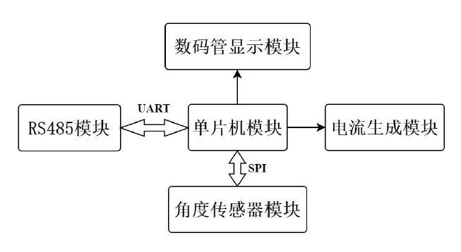

# 电动推杆中角度传感器模块的设计与验证
作者：石磊
## 摘要
角度传感器广泛应用于电动阀门的角度控制，亦可以用于电机驱动的往复运动器
件的行程控制，本课题的目标就是针对电动推杆设计一种基于角度传感器的
角度检测系统，用于间接检测推杆的实际行程。通过减速机构将推杆行程转换为
0-360°的角度。根据需求本文首先确定了用能感应磁场角度的感应芯片MT6816
作为感应器件，用单片机作为数据处理与控制器，用脉宽调制信号（PWM 方式）
控制模拟电流信号输出的设计方案，在充分查阅资料与分析的基础上完成了电路
原理设计、PCB 版制图以及软件编程，并进行了实验验证，实验结果表明本次设
计的角度检测系统实现了0-360°的角度检测量程，分辨率为0.5°的精度，实现
了角度信号RS485 数字方式输出与4-20mA的模拟信号输出，全部指标均满足设
计要求。另外对模拟信号输出进行了线性分析与精度校准。
## 演示视频
[演示视频](https://www.bilibili.com/video/BV1m94y1B74E)

## 硬件

### 模块功能简介
本硬件设计分为五个模块。  
角度传感器模块：选用 MT6816 芯片。该芯片可感应周围磁场方向并编码为角度数据存储在相关寄存器中。其属于角度检测系统的输入。  
单片机模块：选用 STC12C5A60S2 单片机。负责角度检测系统的调度和控制。
数码管显示模块：选用四位共阳极数码管。负责显示角度数据。  
电流生成模块：设计模拟电路实现。输出大小范围为4-20mA的模拟电流，对应0-330°的角度数据。  
RS485 模块：选用MAX485芯片。输出数字形式的角度数据。  
单片机模块通过SPI 接口从角度传感器模块获取角度数据，并对角度数据进行处理，处理后的角度数据送数码管数码管显示，电流生成模块将负责将角度数据映射为电流信号输出，RS485 模块将角度数据以数字形式输出。
### 电路板实物图

### 硬件原理图

### 角度转4-20mA电流线性度验证

## 软件
### 软件流程图

